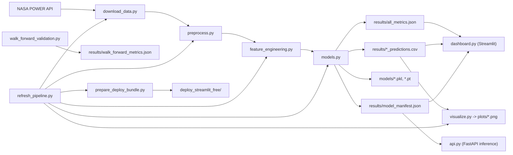
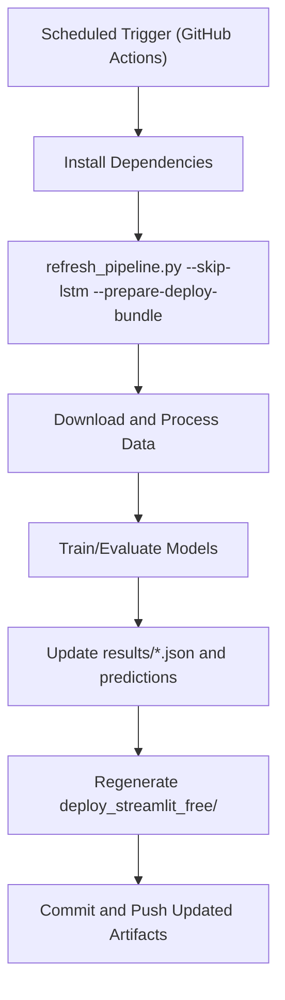

# Renewable Energy Forecasting Project Report

## 1) Project at a Glance

### Plain-language summary
This system predicts **next-hour solar and wind power** for 5 Indian regions using weather data from NASA POWER.  
It collects data, cleans it, builds features, trains multiple ML/DL models, compares model quality, generates plots, serves predictions through an API, and provides an interactive dashboard.

### Why this matters
- Helps decision-makers estimate short-term renewable output.
- Supports operations planning for energy balancing and grid scheduling.
- Provides transparent model comparison region-by-region.

### Current forecast horizon
- **+1 hour** (predicts energy at `t+1` using features at `t`)

---

## 2) Business and Technical Scope

### Regions covered
1. Rajasthan
2. Tamil Nadu
3. Odisha
4. Maharashtra
5. Himachal

### Data period
- 2020-01-01 to 2024-12-31 (hourly)

### NASA POWER weather inputs
1. `ALLSKY_SFC_SW_DWN` -> `solar_irradiance`
2. `WS10M` -> `wind_speed`
3. `T2M` -> `temperature`
4. `RH2M` -> `humidity`

### Targets
Because real generation data is not available:
1. `solar_power = solar_irradiance * 0.2`
2. `wind_power = wind_speed ** 3`

---

## 3) End-to-End Architecture



---

## 4) Repository Structure and Purpose

> Root path: `C:\Users\chand\renewable-forecast`

### Core pipeline files
1. `config.py`  
   Central configuration: regions, API dates/params, feature settings, model hyperparameters.
2. `download_data.py`  
   Downloads hourly weather for all regions from NASA POWER.
3. `preprocess.py`  
   Cleans data, handles missing/sentinel values, constructs synthetic targets.
4. `feature_engineering.py`  
   Adds time, lag, and rolling features; shifts targets to `t+1`.
5. `models.py`  
   Trains/evaluates LR, RF, XGBoost, LSTM and saves metrics, predictions, model files.
6. `visualize.py`  
   Generates saved PNG plots for analysis.
7. `main.py`  
   Runs full pipeline in sequence.

### Serving and operations files
1. `model_selection.py`  
   Creates `results/model_manifest.json` (best overall + best API model by region/target).
2. `api.py`  
   FastAPI service for latest +1h predictions.
3. `walk_forward_validation.py`  
   Backtesting with walk-forward splits.
4. `refresh_pipeline.py`  
   Automated refresh runner (download -> train -> plots -> deploy bundle).
5. `.github/workflows/free-refresh.yml`  
   Weekly free scheduled run (GitHub Actions).

### UI and deployment files
1. `dashboard.py`  
   Interactive Streamlit dashboard with best model badges and latest forecast cards.
2. `prepare_deploy_bundle.py`  
   Creates lightweight free-deploy package.
3. `DEPLOY_FREE.md`  
   Free deployment plan.
4. `API_AND_OPERATIONS.md`  
   API and operations quick guide.
5. `PROJECT_REPORT.md`  
   This document.

### Data/artifact folders
1. `nasa_power_data/` -> raw region CSVs
2. `processed_data/` -> processed and feature-engineered CSVs
3. `models/` -> saved model binaries
4. `results/` -> metrics, predictions, manifests, walk-forward outputs
5. `plots/` -> generated PNG figures
6. `deploy_streamlit_free/` -> lightweight deployment package for free hosting

---

## 5) Data and Feature Schema

## 5.1 Raw data schema (`nasa_power_data/*.csv`)
| Column | Type | Meaning |
|---|---|---|
| `datetime` | datetime | Hour timestamp |
| `solar_irradiance` | float | Surface solar irradiance |
| `wind_speed` | float | 10m wind speed |
| `temperature` | float | Air temperature |
| `humidity` | float | Relative humidity |

## 5.2 Processed schema (`processed_data/*_processed.csv`)
Adds:
1. `solar_power`
2. `wind_power`

## 5.3 Featured schema (`processed_data/*_featured.csv`)
Includes:
1. Time features: `hour`, `day`, `month`, `day_of_week`, `day_of_year`
2. Cyclical encodings: `hour_sin`, `hour_cos`, `month_sin`, `month_cos`
3. Lag features for weather inputs (1, 2, 3, 6, 12, 24h)
4. Rolling mean/std windows (3, 6, 12, 24h)
5. **Target alignment**: `solar_power` and `wind_power` shifted by +1 hour

---

## 6) Training and Evaluation Strategy

## 6.1 Models trained
1. Linear Regression
2. Random Forest Regressor
3. XGBoost Regressor
4. LSTM (PyTorch)

## 6.2 Split strategy
- Time-series aware split (chronological, no shuffling)
- Last 20% for test

## 6.3 Metrics used
1. MAE
2. RMSE
3. R2

## 6.4 Leakage prevention
The project uses **future-target alignment**:
- Features at time `t`
- Targets at time `t+1`

This avoids trivial same-timestamp target reconstruction and gives realistic predictive evaluation.

---

## 7) Model Selection Policy

Selection logic is codified in `model_selection.py`:
1. Primary objective: maximize `R2`
2. Tie-breakers: minimize `RMSE`, then minimize `MAE`
3. Two selections are stored:
   - `best_overall` (can include LSTM)
   - `best_api` (restricted to LR/RF/XGBoost for simple stateless API inference)

Output file:
- `results/model_manifest.json`

---

## 8) Current Output Inventory

As of the latest run:
1. `nasa_power_data/`: 5 raw CSV files
2. `processed_data/`: 10 files (5 processed + 5 featured)
3. `models/`: 40 model files
4. `results/` includes:
   - `all_metrics.json`
   - 10 prediction CSV files (`region_target_predictions.csv`)
   - `model_manifest.json`
   - `walk_forward_metrics.json`
5. `plots/`: 23 PNG files
6. `deploy_streamlit_free/`: ready-to-deploy lightweight app package (~8.8 MB)

---

## 9) How to Run the Project

## 9.1 Environment setup
```bash
pip install -r requirements.txt
```

## 9.2 Run full pipeline (single command)
```bash
python main.py
```

This executes:
1. data download
2. preprocessing
3. feature engineering
4. training/evaluation
5. plotting

## 9.3 Run stage-by-stage
```bash
python download_data.py
python preprocess.py
python feature_engineering.py
python models.py
python visualize.py
python model_selection.py
```

## 9.4 Faster training mode for low-resource runs
```bash
# Windows PowerShell
$env:SKIP_LSTM="1"; python models.py
```

---

## 10) How to Run the Dashboard

```bash
streamlit run dashboard.py
```

Dashboard includes:
1. Region/target controls
2. Model metric cards
3. Best-model badges (overall and API-ready)
4. Actual vs predicted chart
5. Latest +1h forecast tiles using best API models
6. Custom date-time forecast panel (real-time weather backed)
7. Cross-region comparison charts
8. Raw weather explorer charts

---

## 11) How to Run the Inference API

## 11.1 Start API server
```bash
uvicorn api:app --host 0.0.0.0 --port 8000
```

## 11.2 API endpoints
1. `GET /health`
2. `GET /manifest`
3. `GET /predict/latest?region=rajasthan`
4. `GET /predict/latest/all`
5. `GET /predict/at-datetime?region=rajasthan&generation_datetime=2026-04-19T14:00`

## 11.3 Quick test examples
```bash
curl http://127.0.0.1:8000/health
curl "http://127.0.0.1:8000/predict/latest?region=rajasthan"
curl http://127.0.0.1:8000/predict/latest/all
```

---

## 12) How to Run Walk-Forward Backtesting

## 12.1 Default backtest
```bash
python walk_forward_validation.py
```

## 12.2 Focused smoke test
```bash
python walk_forward_validation.py --regions rajasthan --targets solar_power --models "Linear Regression" --folds 2 --test-hours 72
```

Output:
- `results/walk_forward_metrics.json`

---

## 13) Testing and Quality Checks

## 13.1 Syntax/compile check
```bash
python -m py_compile *.py
```

## 13.2 Pipeline artifact checks
After full run, verify:
1. `results/all_metrics.json` exists
2. `results/model_manifest.json` exists
3. 10 prediction CSV files exist in `results/`
4. plot PNG files exist in `plots/`
5. model files exist in `models/`

Example PowerShell:
```powershell
Get-ChildItem results -File
Get-ChildItem plots -File
Get-ChildItem models -File
```

## 13.3 API smoke checks
1. `/health` returns status `ok`
2. `/predict/latest?region=...` returns predictions and model names

## 13.4 Dashboard sanity checks
1. Metric cards render for selected region/target
2. Actual vs predicted chart updates with slider
3. Latest +1h forecast tiles show values

---

## 14) Output and Plot Interpretation Guide (Non-Technical)

1. **R2 closer to 1** means model captures pattern better.
2. **Lower MAE/RMSE** means lower error.
3. Compare models per region and target (solar and wind behave differently).
4. Use latest forecast tiles as most recent next-hour estimate.
5. If one model consistently wins in a region/target, use it operationally (manifest already does this for API).

---

## 15) Free Deployment Plan (Production-like, no paid infra)

## 15.1 Why a bundle is used
Full model artifacts are very large; free git/cloud services are stricter with file size and resource limits.

## 15.2 Build deployment bundle
```bash
python prepare_deploy_bundle.py
```

Generates:
- `deploy_streamlit_free/app.py`
- `deploy_streamlit_free/data/...`
- `deploy_streamlit_free/model_manifest.json`
- `deploy_streamlit_free/requirements.txt`

## 15.3 Deploy bundle to Streamlit Community Cloud
1. Create a separate lightweight GitHub repo.
2. Upload only contents of `deploy_streamlit_free/`.
3. In Streamlit Cloud, choose `app.py` and deploy.

---

## 16) Automation and Scheduled Refresh

Automation runner:
```bash
python refresh_pipeline.py --skip-lstm --prepare-deploy-bundle
```

GitHub Actions workflow:
- `.github/workflows/free-refresh.yml`
- Weekly cron schedule
- Commits updated metrics/predictions/deploy bundle back to repo

### Refresh lifecycle diagram


---

## 17) Operational Runbook

## 17.1 Weekly routine
1. Ensure automation ran successfully.
2. Check if `results/all_metrics.json` changed significantly.
3. Check if best model changed in `results/model_manifest.json`.
4. Validate dashboard and API health.

## 17.2 If metrics degrade
1. Re-run local full pipeline.
2. Run walk-forward validation for degraded region/target.
3. Check data quality in `nasa_power_data/` and `processed_data/`.
4. Compare new vs previous metrics before releasing.

## 17.3 If API fails
1. Confirm manifest exists: `results/model_manifest.json`
2. Confirm model files exist in `models/`
3. Start server again and test `/health`

---

## 18) Risks and Known Constraints

1. Targets are synthetic (not actual plant output).  
   This is suitable for framework validation but should be replaced with real generation data for production business forecasting.
2. LSTM training can be resource-intensive for free automation environments.  
   `--skip-lstm` and `SKIP_LSTM=1` are provided for stable free runs.
3. Free-host deployments may sleep or have usage limits.

---

## 19) Recommended Next Improvements

1. Add real plant generation data integration.
2. Add API authentication and rate limiting.
3. Add unit and integration tests with CI gate.
4. Add drift monitoring and alerting.
5. Add model versioning and rollback strategy.
6. Add confidence intervals/uncertainty estimates.

---

## 20) Quick Command Reference

```bash
# Full pipeline
python main.py

# Dashboard
streamlit run dashboard.py

# API
uvicorn api:app --host 0.0.0.0 --port 8000

# Walk-forward
python walk_forward_validation.py

# Manifest only
python model_selection.py

# Refresh (faster)
python refresh_pipeline.py --skip-lstm --prepare-deploy-bundle

# Build free deploy bundle
python prepare_deploy_bundle.py
```

---

## 21) Final Note for Mixed Audience (Tech + Non-Tech)

- For non-technical stakeholders: use the dashboard and forecast cards for decision support.
- For technical teams: use API, manifest, and scheduled refresh workflow for operations.
- For leadership: this project is now a complete, reusable forecasting platform with clear upgrade path toward enterprise-grade production.
